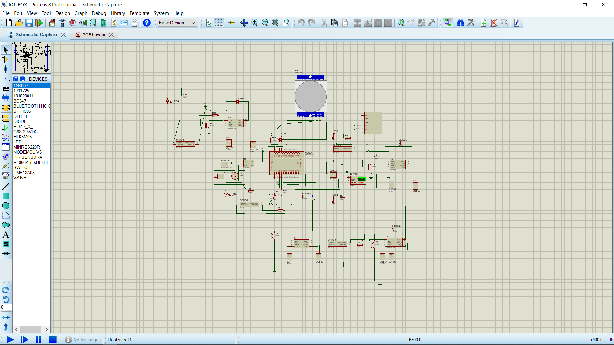
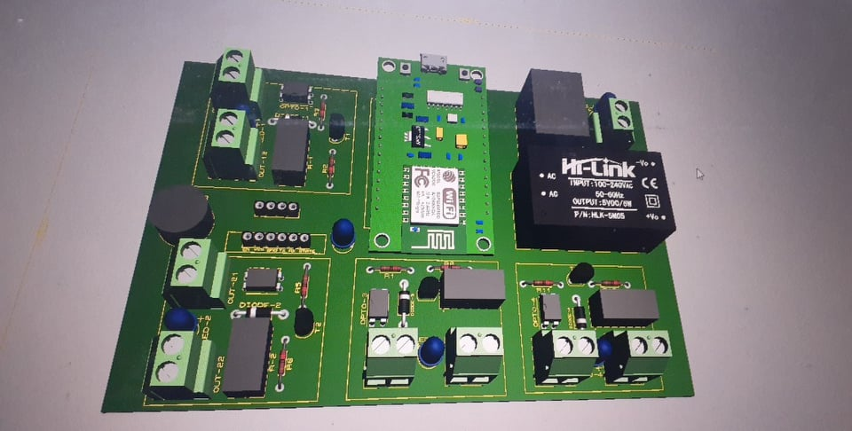
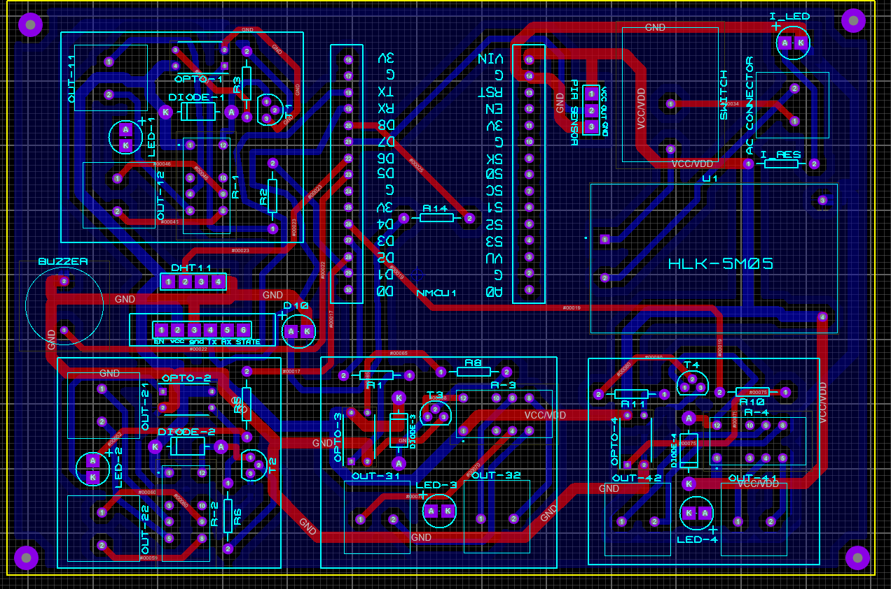
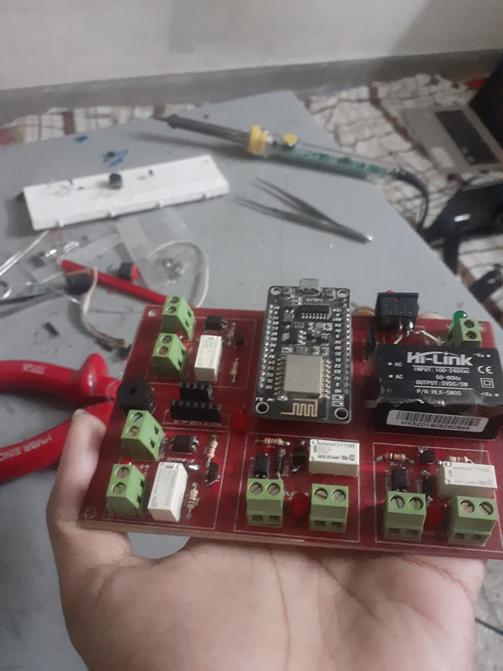
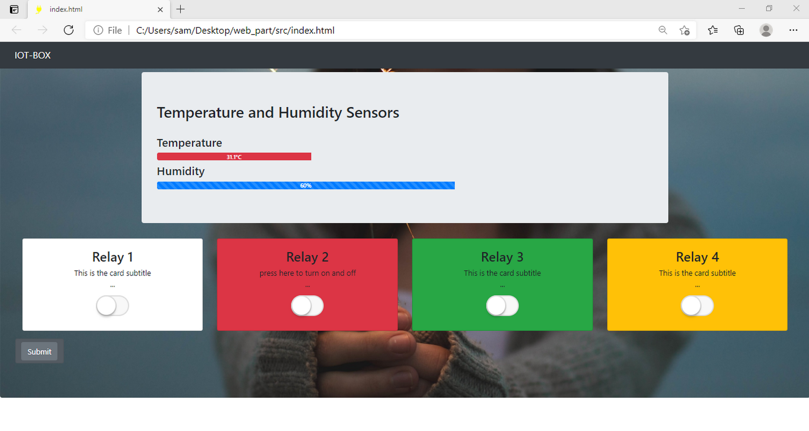
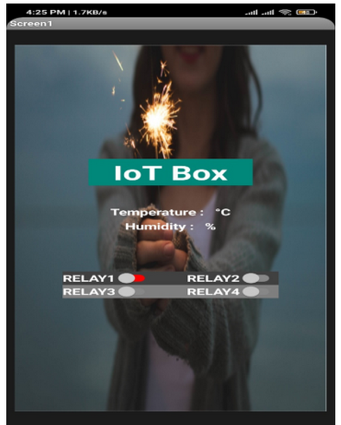
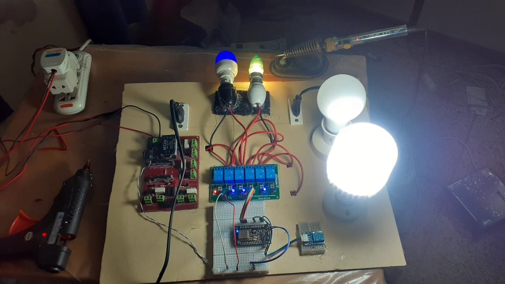

# IoT-Box
NodeMCU-ESP8266 with and without Flask based IoT box by which I am controlling by room's AC line's light fan from Internet and update from temperature,humidity,motion sensors

## Components
* ESP8266 NodeMCU
* Diode 1N4007
* BC547 NPN transistors
* Buzzer
* Optocoupler
* Screw Terminal
* Tactile Switch
* DHT11 Sensor Module
* 5V Relay(OMRON)
* HLK5M05 AC-DC Isolated Power Supply Module
* 6 channel 5V optocoupler based Relay Module(extra)
* HC-SR501 PIR Motion Detector Module

## Design and Framework

* 2D schematic of the main control Unit

    

* 3D model of the circuit board

    

    **Used different footprints from [Component-Search-Engine](https://componentsearchengine.com/) and [SnapEDA](https://www.snapeda.com/)**

## PCB design and fabrication

* Two layer routing design of PCB in proteus   
    
    

* The fabricated **IoT Box** control unit

    

## The Web and APP View

* web-dashboard

    

* app-dashboard

    

  created using MIT App Inventor

## Final Working Output

